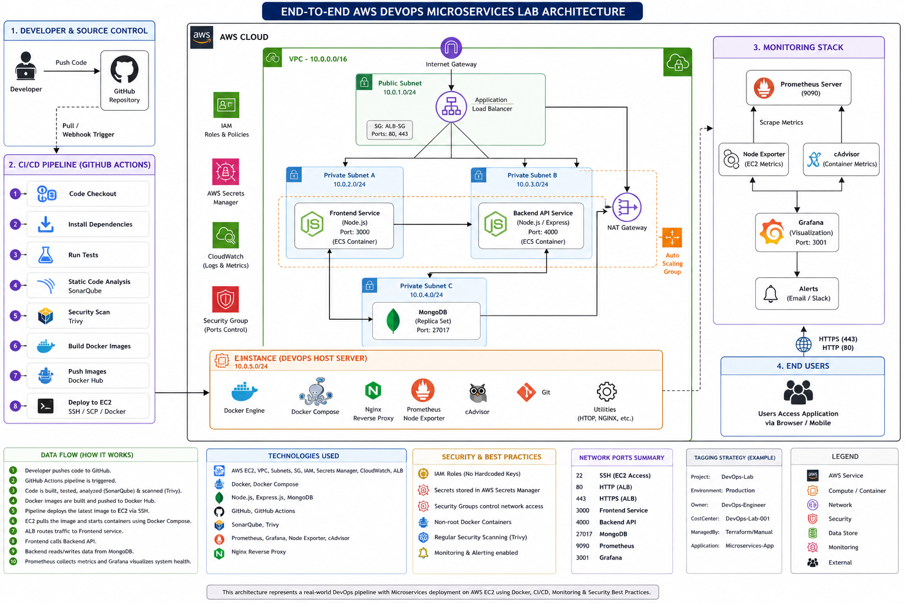

### AWS DEVOPS Lab # 1  

# 🚀 End-to-End AWS DevOps Microservices Lab  

> ## (EC2 + Docker + CI/CD + Monitoring)

---



## 🧪 COMPLETE AWS DEVOPS LAB (BEGINNER → ADVANCED)

We’ll build a complete DevOps system on AWS EC2 using:

- Amazon Web Services  

- Docker 

- GitHub  

- GitHub Actions  

- Prometheus 

- Grafana  

---

## 🎯 LAB GOAL

Build a production-style DevOps environment on Amazon Web Services where you:

- Deploy a microservices-based application  

- Use Docker for containerization

- Manage code with GitHub  

- Automate delivery using GitHub Actions  

- Monitor system using Prometheus + Grafana  

- Apply Linux + Networking + Security + Debugging skills  

👉 **Final Outcome:**  

You behave like a real DevOps Engineer handling production deployment  

---

## 🧩 REAL-LIFE PRACTICAL TASKS

These are not “practice commands” — these are actual job tasks.

---

## 🧱 Infrastructure Tasks (AWS EC2)

- Launch EC2 server for application hosting  

- Configure Security Groups (open ports 22, 80, 443, 3000, 9090)  

- Connect securely using SSH keys  

- Harden server (disable password login, restrict access)  

---

## 🐧 Linux Administration Tasks

- Create users for developers (dev, qa)  

- Assign permissions to shared directories 

- Monitor CPU/memory when app is slow  

- Analyze logs when service crashes (`/var/log`, `journalctl`)  

- Write backup script: 

```
backup-$(date).tar.gz
```

- Kill high CPU processes  

- Manage services using systemd  

---

## 🔧 Git & Collaboration Tasks

- Initialize project repo on EC2 

- Push code to GitHub  

- Create feature branches (feature/login) 

- Resolve merge conflicts  

- Use git revert for production rollback  

- Tag releases (v1.0, v2.0)  

---

## 🐳 Docker Tasks

- Convert app into Docker image  

- Run container with port mapping  

- Debug container crash (`docker logs`)  

- Use volumes for persistent data  

- Build multi-container app using docker-compose  

- Push images to Docker Hub  

---

## 🧩 Microservices Tasks

- Build:

    - Frontend service  

    - Backend API 

    - Database service  

- Connect services using Docker network  

- Simulate service failure and recovery  

---

## 🔁 CI/CD Tasks

- Automate pipeline:

    - Code push → Build → Test → Deploy  

- Store secrets securely
 
- Fix failed pipelines
  
- Deploy app automatically to EC2  

---

## 🔐 Security Tasks

- Use IAM roles instead of credentials  

- Store secrets in GitHub Secrets  

- Scan images using Trivy 

- Remove hardcoded passwords  

---

## 📊 Monitoring Tasks

- Install Prometheus & Grafana:

- Monitor:

    - CPU usage  

    - Memory usage  

    - Container health  

- Detect system overload

---

## 🚨 Real Incident Simulation

- App not accessible → debug ports 

- High CPU → find process  

- Container crash → restart + logs  

- Wrong deployment → rollback  

---

## 🔄 DATA FLOW DIAGRAM (TEXT)

```
Developer → GitHub → CI/CD Pipeline → Docker Build → Docker Registry → EC2 → Running Containers → User Access

Monitoring Flow:
EC2 + Containers → Prometheus → Grafana Dashboard
```

---

## 🔍 STEP-BY-STEP FLOW

1. Developer writes code  

2. Code pushed to GitHub  

3. GitHub Actions triggers pipeline  

4. Docker image is built  

5. Image pushed to Docker Hub  

6. EC2 pulls latest image  

7. Container starts  

8. User accesses app 

9. Prometheus collects metrics  

10. Grafana visualizes system health  

---

## 🖼️ DIGITAL VISUAL ARCHITECTURE

Here is a clean architecture diagram (text-style visual)

```
                   👨‍💻 Developer
                        │
                        ▼
               ┌──────────────────┐
               │   GitHub Repo    │
               └──────────────────┘
                        │
                        ▼
         ┌────────────────────────────┐
         │   GitHub Actions (CI/CD)   │
         │ Build → Test → Dockerize   │
         └────────────────────────────┘
                        │
                        ▼
               ┌──────────────────┐
               │  Docker Registry │
               │   (Docker Hub)   │
               └──────────────────┘
                        │
                        ▼
        ┌────────────────────────────────┐
        │        AWS EC2 Server          │
        │                                │
        │  ┌───────────────┐             │
        │  │  Frontend     │ (3000)      │
        │  └───────────────┘             │
        │          │                     │
        │          ▼                     │
        │  ┌───────────────┐             │
        │  │  Backend API  │ (4000)      │
        │  └───────────────┘             │
        │          │                     │
        │          ▼                     │
        │  ┌───────────────┐             │
        │  │   Database    │ (MongoDB)   │
        │  └───────────────┘             │
        │                                │
        └────────────────────────────────┘
                        │
                        ▼
                🌐 End Users (Browser)

---------------------------------------------------

📊 MONITORING LAYER

EC2 + Containers
        │
        ▼
 ┌──────────────┐
 │ Prometheus   │ (9090)
 └──────────────┘
        │
        ▼
 ┌──────────────┐
 │ Grafana      │ (3001)
 └──────────────┘
```

## 🧠 HOW THIS LAB WORKS (IMPORTANT)

This lab simulates a real company workflow:

---

## 🔁 Continuous Loop

- Developer writes code

- CI/CD builds and deploys  

- App runs on EC2  

- Monitoring tracks system health  

- Issues occur in production  

- DevOps engineer investigates and fixes 

- Cycle repeats continuously  

---

## 🎯 FINAL UNDERSTANDING

This lab teaches you:

- Infrastructure thinking (not just commands)  

- System flow (how everything connects end-to-end) 

- Debugging real production problems  

- Automation mindset (CI/CD thinking) 

- Production-level responsibility and ownership  

---

# 🧱 PHASE 1: AWS EC2 SETUP (FOUNDATION)

## ✅ Step 1: Launch EC2 Instance
OS: Ubuntu 22.04 or Amazon Linux 2023  
Instance type: t2.micro (free tier)

### Why this matters:

- EC2 = your real Linux server in cloud

- Ubuntu = most widely used DevOps OS

- t2.micro = free lab environment

---

## ✅ Step 2: Security Group (VERY IMPORTANT)

Allow ports:

| Port      | Purpose                |
| --------- | ---------------------- |
| 22        | SSH access             |
| 80        | HTTP web traffic       |
| 443       | HTTPS secure traffic   |
| 3000–5000 | Apps (Docker services) |
| 9090      | Prometheus             |
| 3001      | Grafana                |

### Why this is critical:

Security Group = firewall of AWS

👉 It controls WHO can access your server
---

## ✅ Step 3: Connect via SSH

```bash
chmod 400 mykey.pem
ssh -i mykey.pem ubuntu@<EC2_PUBLIC_IP>
```

---

## ✅ Step 4: Install Base Tools

```bash
sudo apt update && sudo apt upgrade -y
sudo apt install -y git curl wget unzip net-tools htop
```

### Why each tool exists:

| Tool      | Purpose            |
| --------- | ------------------ |
| git       | version control    |
| curl      | API testing        |
| wget      | file download      |
| unzip     | extract files      |
| net-tools | network commands   |
| htop      | process monitoring |

---

## 🎯 Practice Tasks

- Create 3 directories: dev, test, prod  

```
mkdir dev test prod
```
### Why?

Simulates real environment separation:

- dev = development

- test = testing

- prod = production

- SSH reconnect without errors  

- Block and allow ports from security group  


---

# 🐧 PHASE 2: LINUX (REAL DEVOPS TASKS)

## 🔹 File & Directory

```bash
ls -la
cp file1.txt backup.txt
mv file1.txt /tmp/
rm -ri ./temp*
find /var/log -name "*.log"
```

#### This Command Is Dangerous For Beginners

```
rm -rf temp*
```

- If wildcard expands unexpectedly,it may delete unintended files.

- Safer beginner version:

```
rm -rf ./temp*
```

- Even safer:

```
rm -ri ./temp*
```

- Explanation:

  - -r recursive

  - -i asks confirmation

#### This Command Is Heavy

```
find / -name "*.log"
```

- Problem:

  - scans whole filesystem

  - many permission denied errors

  - can be slow

- Better:

```
find /var/log -name "*.log"
```

---

## 🔹 Users & Permissions

```bash
sudo useradd devops
sudo passwd devops
sudo groupadd engineers
sudo usermod -aG engineers devops
chmod 755 script.sh
chown ubuntu:ubuntu file.txt
```

---

## 🔹 Processes

```bash
ps aux
top
htop
kill -9 <PID>
```

- next commands won't run until you press:

  - q for top

  - F10 or q for htop

For automation scripts:

- avoid interactive commands

Better:

```
top -b -n 1
```

---

## 🔹 Disk

```bash
df -h
du -sh *
```

---

## 🔹 Logs

```bash
cd /var/log
tail -f syslog
journalctl -xe
```

#### This Changes Current Directory Permanently

```
cd /var/log
```

After this command,
script stays inside /var/log.

Everything after runs from there.

This is VERY important in Bash scripting.

Example:
If later you use:

```
rm file.txt
```

it removes:
/var/log/file.txt

NOT file in original directory.

---

## 🔹 Networking

```bash
ping google.com
curl ifconfig.me
ss -tulnp
```

---

## 🔹 Bash Script (REAL)

```
sudo nano linux.sh
```

```bash
#!/bin/bash

# ---------------------------------------------------
# Exit on Error
# ---------------------------------------------------

set -e

# set -e
# If any command fails (returns error),
# stop the script immediately.
# This makes scripts safer for automation.

echo "=================================="
echo " End-to-End AWS DevOps Microservices Lab"
echo "=================================="

# ---------------------------------------------------
# INSTALL BASE TOOLS
# ---------------------------------------------------

echo "Installing Base Tools..."

# Update package list from repositories
sudo apt update

# Upgrade installed packages
# -y = automatically answer YES
sudo apt upgrade -y

# Install useful Linux and DevOps tools
sudo apt install -y git curl wget unzip net-tools htop

# git       = version control
# curl      = API testing / downloading
# wget      = file downloading
# unzip     = extract zip files
# net-tools = networking commands
# htop      = system monitoring tool

echo "Base tools installed successfully."

# ---------------------------------------------------
# CREATE DIRECTORIES
# ---------------------------------------------------

echo "Creating directories..."

# mkdir = create directory
# -p = no error if directory already exists
mkdir -p dev test prod

# Creates:
# dev/
# test/
# prod/

echo "Directories created."

# ---------------------------------------------------
# FILE & DIRECTORY COMMANDS
# ---------------------------------------------------

echo "Running File & Directory commands..."

# ls = list files
# -l = long format
# -a = show hidden files
ls -la

# Check if file1.txt exists
# -f = regular file exists

if [ -f file1.txt ]
then
    # Copy file1.txt to backup.txt
    cp file1.txt backup.txt

    # Move file1.txt to /tmp directory
    mv file1.txt /tmp/

else
    echo "file1.txt not found."
fi

# rm = remove/delete
# -r = recursive (delete folders/files inside)
# -i = ask before deleting
rm -ri ./temp*

# find = search files
# Search all .log files inside /var/log
find /var/log -name "*.log"

# ---------------------------------------------------
# USERS & PERMISSIONS
# ---------------------------------------------------

echo "Managing Users & Permissions..."

# id username
# Check if user exists

# &>/dev/null
# Hide normal output and error messages

if id "devops" &>/dev/null
then
    echo "User devops already exists."
else
    # Create new user
    sudo useradd devops

    # Set password for user
    sudo passwd devops
fi

# Check if group exists
if getent group engineers > /dev/null
then
    echo "Group engineers already exists."
else
    # Create group
    sudo groupadd engineers
fi

# Add user 'devops' into 'engineers' group
# -a = append
# -G = secondary group
sudo usermod -aG engineers devops

# chmod = change permissions
# 755 means:
# owner = rwx
# group = r-x
# others = r-x

chmod 755 script.sh

# chown = change owner
# ubuntu:ubuntu = owner:group
sudo chown ubuntu:ubuntu file.txt

echo "Users and permissions configured."

# ---------------------------------------------------
# PROCESSES
# ---------------------------------------------------

echo "Checking processes..."

# Show running processes
ps aux

# top command in batch mode
# -b = batch mode
# -n 1 = run once
top -b -n 1

# ---------------------------------------------------
# KILL PROCESS
# ---------------------------------------------------

echo "Process Management"

# Ask user to enter PID
# PID = Process ID

read -p "Enter PID to kill: " PID

# Check if process exists
if ps -p $PID > /dev/null
then
    # Kill process
    kill $PID

    echo "Process $PID killed successfully."
else
    echo "PID $PID does not exist."
fi

# ---------------------------------------------------
# DISK
# ---------------------------------------------------

echo "Checking disk usage..."

# df = disk filesystem usage
# -h = human readable
df -h

# du = directory usage
# -s = summary
# -h = human readable
du -sh *

# ---------------------------------------------------
# LOGS
# ---------------------------------------------------

echo "Checking logs..."

# Show last 20 lines from syslog
tail -20 /var/log/syslog

# Show last 20 journal logs
journalctl -n 20

# ---------------------------------------------------
# NETWORKING
# ---------------------------------------------------

echo "Checking networking..."

# ping = test internet/network connectivity
# -c 4 = send 4 packets only
ping -c 4 google.com

# curl = fetch data from internet
# -s = silent mode
# ifconfig.me returns public IP address
curl -s ifconfig.me

# Print empty line
echo ""

# ss = socket statistics
# Shows listening ports and services

# -t = TCP
# -u = UDP
# -l = listening ports
# -n = numeric output
# -p = process using port

ss -tulnp

# ---------------------------------------------------
# THE END
# ---------------------------------------------------

echo "Lab completed successfully."
```


---

## 🎯 Practice Tasks

- Create script to delete old logs  
- Monitor CPU usage  
- Create auto backup script  

---

# 🔧 PHASE 3: GIT + GITHUB LAB

## Install Git

```bash
sudo apt install git -y
git config --global user.name "yourname"
git config --global user.email "you@example.com"
```

---

## Create Repo

```bash
mkdir microservices-app && cd microservices-app
git init
```

---

## Connect to GitHub

```bash
git remote add origin https://github.com/<username>/devops-lab.git
```

---

## Branching

```bash
git checkout -b feature-login
git branch -m feature-auth
git branch -d old-branch
```

---

## Advanced Git

```bash
git stash
git stash pop
git tag v1.0
git log --oneline
git diff
git reset --hard HEAD~1
git revert HEAD
git cherry-pick <commit>
```

---

## 🎯 Practice Tasks

- Create 2 branches and merge them  
- Create tag v1.0 and push  
- Simulate conflict and resolve  

---

# 🐳 PHASE 4: DOCKER LAB

## Install Docker

```bash
sudo apt install docker.io -y
sudo systemctl enable docker
sudo systemctl start docker
sudo usermod -aG docker $USER
```

---

## Dockerfile Example (Node.js)

```dockerfile
FROM node:18
WORKDIR /app
COPY . .
RUN npm install
CMD ["node", "app.js"]
```

---

## Build & Run

```bash
docker build -t app:v1 .
docker run -d -p 3000:3000 app:v1
```

---

## Volumes

```bash
docker run -d -v /data:/app/data app:v1
```

---

## Docker Compose

```yaml
version: "3"
services:
  app:
    build: .
    ports:
      - "3000:3000"
```

## Run in Background

```bash
docker-compose up -d
```
- -d means detached mode. 
---

## Check Running Containers

```
docker ps
```

## Stop Containers

```
docker compose down
```

This stops and removes containers.

## Most Important Compose Commands

### Start

```
docker compose up
```

### Background Start

```
docker compose up -d
```

### Stop

```
docker compose stop
```

### Remove Everything

```
docker compose down
```

### Restart

```
docker compose restart
```

### View Logs

```
docker compose logs
```

### Live Logs

```
docker compose logs -f
```

### Build Images

```
docker compose build
```

### Pull Images

```
docker compose pull
```

### Check Running Services

```
docker compose ps
```


## 🎯 Practice Tasks

- Run 2 containers  
- Connect containers via network  
- Debug container crash  

---

# 🧩 PHASE 5: MICROSERVICES PROJECT (REAL APP)

## Architecture

- frontend (Node.js)  
- backend (Node.js API)  
- database (MongoDB)  

---

## Backend Example

```javascript
const express = require('express');
const app = express();

app.get('/api', (req,res)=>{
  res.send("Hello from backend");
});

app.listen(4000);
```

---

## Connect Services (Docker Network)

```bash
docker network create devops-net
docker run -d --network devops-net backend
docker run -d --network devops-net frontend
```

---

## 🎯 Practice Tasks

- Add second API endpoint  
- Break service → debug logs  

---

# 🔁 PHASE 6: CI/CD WITH GITHUB ACTIONS

## Create Workflow

```yaml
name: DevOps Pipeline

on:
  push:
    branches: [main]

jobs:
  build:
    runs-on: ubuntu-latest

    steps:
    - uses: actions/checkout@v3

    - name: Build Docker Image
      run: docker build -t app .

    - name: Push to DockerHub
      run: docker push <username>/app

    - name: Deploy to EC2
      run: ssh ubuntu@<IP> "docker pull <username>/app && docker run -d -p 3000:3000 <username>/app"
```

---

## 🎯 Practice Tasks

- Trigger pipeline on push  
- Break build intentionally  
- Fix pipeline  

---

# 🔐 PHASE 7: SECURITY

## IAM (AWS)

- IAM Role for EC2  
- No hardcoded credentials  

---

## Secrets in GitHub  

### Store Secrets

- SSH key  
- Docker credentials  

---

## Vulnerability Scan (Trivy)

```bash
sudo apt install trivy
trivy image app:v1
```

---

# 📊 PHASE 8: MONITORING

## Install Prometheus

```bash
wget https://github.com/prometheus/prometheus/releases/download/...tar.gz
```

---

## Install Grafana

```bash
sudo apt install grafana -y
sudo systemctl start grafana-server
```

---

## Access Grafana

```
http://<EC2-IP>:3001
```

---

## 🎯 Practice Tasks

- Monitor CPU usage  
- Add dashboard  
- Simulate high load  

---

# 🔥 FINAL REAL-WORLD SCENARIO

You are a DevOps Engineer:

- Developer pushes code  
- Pipeline runs  
- Docker image builds  
- Security scan runs  
- Image pushed  
- EC2 auto-updates container  
- Monitoring shows metrics  

---

# ⚠️ TROUBLESHOOTING (IMPORTANT)

## Docker Issue
```bash
sudo systemctl restart docker
```

## Port Issue
```bash
sudo ss -tulnp
```

## Permission Issue
```bash
sudo chmod -R 777 project/
```

## Pipeline Issue
- Check GitHub Actions logs  
- Verify secrets  

---

# 🎯 FINAL RESULT (WHAT YOU WILL MASTER)

After completing this lab, you will:

- Think like a DevOps Engineer  
- Deploy real microservices  
- Build CI/CD pipelines  
- Debug production issues  
- Work with AWS in real scenarios  

---

# 💡 IMPORTANT (REAL TALK)

Don’t just read this.

👉 Build it step-by-step  
👉 Break things intentionally  
👉 Fix them  

That’s how DevOps engineers are made — not by theory.

---

# 🚀 Best Way For S3 Data Transfer

### 1. Create Bucket In New AWS Account 

_Example:_
- Old bucket: `"old-bucket"`
- New bucket: `"new-bucket"`

### 2. In NEW Account Add Bucket Policy 

- Go to:  `S3 → new-bucket → Permissions → Bucket Policy`

#### Replace IDs and paste:

```
{
  "Version": "2012-10-17",
  "Statement": [
    {
      "Effect": "Allow",
      "Principal": {
        "AWS": "arn:aws:iam::OLD_ACCOUNT_ID:root"
      },
      "Action": [
        "s3:PutObject",
        "s3:ListBucket"
      ],
      "Resource": [
        "arn:aws:s3:::new-bucket",
        "arn:aws:s3:::new-bucket/*"
      ]
    }
  ]
}
```

### 3. Configure AWS CLI With OLD Account

```
aws configure --profile old
```

### 4. Direct Transfer (No Download)

```
aws s3 sync s3://old-bucket s3://new-bucket --profile old
```
---
# 📘 AWS S3 to S3 Data Transfer Lab

This lab teaches you:

✅ Transfer files from one S3 bucket to another using AWS Console

✅ Transfer files using AWS CLI on EC2

✅ Understand every command and why we use it

✅ Practice real DevOps-style S3 operations

We will do everything inside the same AWS account.

## 🌿 LAB OVERVIEW

We will create:

| Resource           | Purpose                          |
| ------------------ | -------------------------------- |
| Source Bucket      | Original files                   |
| Destination Bucket | New location                     |
| EC2 Instance       | Run AWS CLI commands             |
| IAM Role           | Give EC2 permission to access S3 |

## 🧱 PHASE 1 — CREATE S3 BUCKETS

### ✅ STEP 1 — Login to AWS Console

- Open: AWS Console

- Search for: S3

- Open: Amazon S3

### ✅ STEP 2 — Create SOURCE Bucket

- Click: Create bucket

Example:

| Setting             | Value                 |
| ------------------- | --------------------- |
| Bucket Name         | my-source-bucket-demo |
| Region              | us-east-1             |
| Block Public Access | Keep default          |

- Click:  Create bucket

### ✅ STEP 3 — Create DESTINATION  Bucket

- Again click: Create bucket

Example:

| Setting     | Value                      |
| ----------- | -------------------------- |
| Bucket Name | my-destination-bucket-demo |
| Region      | us-east-1                  |

- Click: Create bucket

## 🧱 PHASE 2 — UPLOAD TEST FILES

### ✅ STEP 4 — Upload Files to Source Bucket

- Open: my-source-bucket-demo

- Click: Upload

- Upload:

  - images

  - txt files

  - zip files

  - videos

Example:

- test1.txt

- backup.zip

- image.png

- Click: Upload

Now source bucket contains data.

Destination bucket is empty.

## 🧱 PHASE 3 — S3 TO S3 COPY USING AWS CONSOLE

### ✅ METHOD 1 — COPY FILES USING AWS CONSOLE

This is easiest for beginners.

### ✅ STEP 5 — Select Files

Inside source bucket:

- Select files Click: Copy

### ✅ STEP 6 — Open Destination Bucket

- Go back to S3.

- Open: destination bucket

- Click: Paste

AWS now copies files internally.

### 🧠 What Actually Happened?

AWS copied objects:

```
Source Bucket  →  Destination Bucket
```

WITHOUT downloading to your laptop.

This is:

- faster

- cheaper

- internal AWS transfer

## 🧱 PHASE 4 — EC2 + AWS CLI METHOD (REAL DEVOPS METHOD)

Now we do professional method.

### ✅ STEP 7 — Launch EC2 Instance

- Go to: Amazon EC2

- Click: Launch Instance

-  Recommended Settings

| Setting        | Value              |
| -------------- | ------------------ |
| Name           | s3-transfer-server |
| AMI            | Ubuntu 22.04       |
| Type           | t2.micro           |
| Key Pair       | Create/select      |
| Security Group | Allow SSH          |

- Click: Launch Instance

## 🧱 PHASE 5 — CREATE IAM ROLE FOR EC2

This is VERY IMPORTANT.

EC2 needs permission to access S3.

### ✅ STEP 8 — Create IAM Role

#### Search: IAM

- Open: AWS IAM

- Go: Roles → Create Role 

#### Trusted Entity

- Choose: AWS Service

- Use case: EC2

- Click: Next

#### Add Permissions

- Attach policy: AmazonS3FullAccess

⚠️ For learning lab only.

#### In production:

use custom least-privilege policies

- Click: Next

- Role Name:

```
EC2-S3-Access-Role
```

- Create role.

### ✅ STEP 9 — Attach Role to EC2

- Go: EC2 Instances

- Select your instance.

- Actions → Security → Modify IAM Role

- Attach: EC2-S3-Access-Role

- Save.

## 🧱 PHASE 6 — CONNECT TO EC2

### ✅ STEP 10 — SSH Into EC2

#### From Linux/macOS:

```
ssh -i mykey.pem ubuntu@EC2_PUBLIC_IP
```

From Windows:

- use PowerShell

- or PuTTY

### ✅ STEP 11 — Verify AWS CLI

Ubuntu usually already has AWS CLI.

- Check:

```
aws --version
```

Example:

```
aws-cli/2.x.x
```

### 🧠 Why We Need AWS CLI?

AWS CLI allows:

- automation

- scripting

- backups

- migrations

- DevOps pipelines

Real engineers mostly use CLI.

## 🧱 PHASE 7 — TEST S3 ACCESS

### ✅ STEP 12 — Check IAM Role Works

- Run:

```
aws s3 ls
```

### 🧠 What This Command Does

```
aws s3 ls
```

Meaning:

| Part | Meaning            |
| ---- | ------------------ |
| aws  | AWS CLI tool       |
| s3   | Work with S3       |
| ls   | List buckets/files |

You should see both buckets.

Example:

```
2026-05-15 my-source-bucket-demo
2026-05-15 my-destination-bucket-demo
```

## 🧱 PHASE 8 — COPY FILES USING AWS CLI

### ✅ STEP 13 — Copy Single File

- Syntax:

```
aws s3 cp SOURCE DESTINATION
```

Example:

```
aws s3 cp s3://my-source-bucket-demo/test1.txt s3://my-destination-bucket-demo/
```

### 🧠 What This Command Means

| Part               | Meaning       |
| ------------------ | ------------- |
| cp                 | copy          |
| s3://              | S3 path       |
| source bucket      | original file |
| destination bucket | target        |

### ✅ STEP 14 — Verify File

- Run:

```
aws s3 ls s3://my-destination-bucket-demo/
```

You should see:

- test1.txt

## 🧱 PHASE 9 — COPY ENTIRE BUCKET

### ✅ STEP 15 — Recursive Copy

```
aws s3 cp s3://my-source-bucket-demo s3://my-destination-bucket-demo --recursive
```

### 🧠 Why --recursive?

Without it:

- only one file copies

With it:

- all folders

- all files

- entire structure copies

## 🧱 PHASE 10 — USING sync (BEST METHOD)

This is most important command.

### ✅ STEP 16 — Sync Buckets

```
aws s3 sync s3://my-source-bucket-demo s3://my-destination-bucket-demo
```

### 🧠 What sync Does

- sync compares:

| Source | Destination |
| ------ | ----------- |
| file1  | file1       |
| file2  | missing     |
| file3  | old version |

Then only transfers:

- new files

- changed files

This saves:

- bandwidth

- time

- money

### 🧠 Difference Between cp vs sync

| Command | Purpose               |
| ------- | --------------------- |
| cp      | simple copy           |
| sync    | smart synchronization |

## 🧱 PHASE 11 — DELETE EXTRA FILES

### ✅ STEP 17 — Mirror Source Exactly

```
aws s3 sync s3://my-source-bucket-demo s3://my-destination-bucket-demo --delete
```

### ⚠️ IMPORTANT

--delete removes files from destination that do not exist in source.

Example:

| Source      | Destination |
| ----------- | ----------- |
| A           | A           |
| B           | B           |
| ❌ C missing | C deleted   |

Use carefully.

## 🧱 PHASE 12 — CHECK FILES

### ✅ STEP 18 — List Bucket Files

```
aws s3 ls s3://my-source-bucket-demo --recursive
```

or 

```
aws s3 ls s3://my-destination-bucket-demo --recursive
```

### 🧠 What --recursive Means Here

Normally:

- only top-level files shown

Recursive:

- show all folders/files deeply

## 🧱 PHASE 13 — OPTIONAL ADVANCED COMMANDS

### ✅ Copy With Different Storage Class

```
aws s3 cp s3://my-source-bucket-demo/test.zip s3://my-destination-bucket-demo/ --storage-class STANDARD_IA
```

### 🧠 Why?

Store copied object in cheaper storage class.

Example:

- backups

- archives

### ✅ Dry Run (VERY IMPORTANT)

```
aws s3 sync s3://my-source-bucket-demo s3://my-destination-bucket-demo --dryrun
```

### 🧠 Why --dryrun?

Shows:

- what WOULD happen

But:

- changes nothing

Excellent for safety.

## 🧱 PHASE 14 — REAL DEVOPS USE CASES

### 🚀 Where Engineers Use This

| Use Case          | Example                      |
| ----------------- | ---------------------------- |
| Backup            | Daily bucket backup          |
| Migration         | Move apps to new environment |
| Disaster Recovery | Copy to DR region            |
| CI/CD             | Upload website artifacts     |
| Log Archiving     | Move logs automatically      |

## 🧱 PHASE 15 — CLEANUP

Avoid AWS charges.

### ✅ STEP 19 — Delete Objects

```
aws s3 rm s3://my-source-bucket-demo --recursive
```

```
aws s3 rm s3://my-destination-bucket-demo --recursive
```

### ✅ STEP 20 — Delete Buckets

```
aws s3 rb s3://my-source-bucket-demo
```

```
aws s3 rb s3://my-destination-bucket-demo
```

### ✅ STEP 21 — Terminate EC2

- Go:

  - EC2

  - Instance State

  - Terminate

## 🌿 MOST IMPORTANT COMMANDS SUMMARY

| Command     | Purpose       |
| ----------- | ------------- |
| aws s3 ls   | list          |
| aws s3 cp   | copy          |
| aws s3 sync | synchronize   |
| aws s3 rm   | delete files  |
| aws s3 rb   | remove bucket |

## 🚀 BEST PRACTICE FOR REAL ENGINEERS

Usually professionals use:

```
aws s3 sync
```

Because:

  - efficient

  - smart

  - safe

  - fast

Especially with:

```
--dryrun
```

first.

## 🌿 FINAL REAL-WORLD EXAMPLE

```
aws s3 sync s3://production-backup s3://dr-backup --delete
```

Meaning:

> Make disaster recovery bucket identical to production backup bucket.

This is extremely common in DevOps and cloud operations.
---
